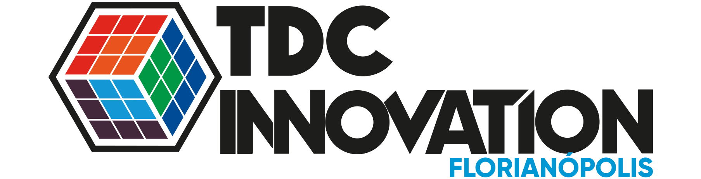

# NLP Overview at TDC Innovation 2023

This repository contains the slides and code for the [TDC Innovation](https://thedevconf.com/tdc/2023/innovation/) talk on NLP entitled **Unlocking text data to leverage business decision making through Natural Language Processing systems**.

## Table of Contents  
<!--ts-->
   1. [About the Lecture](#about)
   2. [Covered Tasks and Available Codes](#codes)
   3. [References](#references)
   4. [Speaker](#speaker)
<!--te-->  

## 1. About the Lecture
[Back to ToC](#toc)

Natural Language Processing (NLP) has seen incredible advancements in recent years, including the development of large language models (LLM) such as ChatGPT, that can perform a wide range of NLP tasks. 

In this lecture, we will explore how NLP techniques, including those used in LLM, can be used to extract valuable insights from text data, speed up document analysis, and inform business decisions. 

You'll gain a better understanding of the real-world applications of NLP such as 
sentiment analysis, 
language modeling, 
text summarization,
named entity recognition,
information extraction and 
information retrieval. 

Additionally, we will explore the challenges of implementing NLP systems in a business context, including how to develop and deploy scalable and reusable solutions. 

As businesses continue to generate vast amounts of textual data, from customer feedback to social media posts, not counting external sources such as news articles, the need for NLP systems to unlock the potential of this data has never been greater. 

Register now to unlock the benefits of NLP for your business!

## 2. Covered Tasks and Available Codes
[Back to ToC](#toc)

### Language Modeling

This is the task of predicting what the next word in a sentence will be based on the history of previous words. 

Available codes snippets:
  * [Masked Language Modeling with HuggingFace Transformers](https://github.com/larpig/tdc-innovation-2023-nlp-overview/blob/main/codes/Masked%20Language%20Modeling%20with%20HuggingFace%20Transformers.ipynb)

### Information Retrieval

This is the task of finding documents relevant to a user query from a large collection. 

Available codes snippets:
  * [Sentence Similarity with Sentence Transformers and HuggingFace Transformers](https://github.com/larpig/tdc-innovation-2023-nlp-overview/blob/main/codes/Sentence%20Similarity%20with%20Sentence%20Transformers%20and%20HuggingFace%20Transformers.ipynb)

### Information Extraction

This is the task of extracting relevant information from text, such as calendar events from emails or the names of people mentioned in a social media post.

Available codes snippets:
  * [Named Entity Recognition (NER) with Spacy](https://github.com/larpig/tdc-innovation-2023-nlp-overview/blob/main/codes/Named%20Entity%20Recognition%20(NER)%20with%20Spacy.ipynb)

### Text Classification

This is the task of bucketing the text into a known set of categories based on its content.

Available codes snippets:
  * [Zero-Shot Classification with HuggingFace Transformers](https://github.com/larpig/tdc-innovation-2023-nlp-overview/blob/main/codes/Zero-Shot%20Classification%20with%20HuggingFace%20Transformers.ipynb)

### Summarization

This task aims to create short summaries of longer documents while retaining the core content and 
preserving the overall meaning of the text.

Available codes snippets:
  * [Summarization with HuggingFace Transformers](https://github.com/larpig/tdc-innovation-2023-nlp-overview/blob/main/codes/Summarization%20with%20HuggingFace%20Transformers.ipynb)

### Question Answering

This is the task of building a system that can automatically answer questions posed in natural language.

Available codes snippets:
  * [Question Answering (QA) with HuggingFace Transformers](https://github.com/larpig/tdc-innovation-2023-nlp-overview/blob/main/codes/Question%20Answering%20(QA)%20with%20HuggingFace%20Transformers.ipynb)

### Translation]

This is the task of converting a piece of text from one language to another.

Available codes snippets:
  * [Translation with HuggingFace Transformers](https://github.com/larpig/tdc-innovation-2023-nlp-overview/blob/main/codes/Translation%20with%20HuggingFace%20Transformers.ipynb)

## 4. References
[Back to ToC](#toc)

The lecture references can be found on the [slides](https://github.com/larpig/tdc-innovation-2023-nlp-overview/blob/main/%5B20230614%5D%20TDC%20Innovation%202023%20-%20NLP%20Overview.pdf) and in the [codes](https://github.com/larpig/tdc-innovation-2023-nlp-overview/tree/main/codes).

## 3. Speaker
[Back to ToC](#toc)

Luis is a Data Scientist with +7 years of experience in the field, working especially on Recommender Systems and Natural Language Processing projects. 
He is currently a Data Science Consultant at Aubay Portugal, acting as a Principal Data Scientist for Banco de Portugal in an NLP project.
Previously, he was Lead Data Scientist at CI&T, a digital transformation company, where he specially helped to develop a recommender system for Nestlé, the largest CPG company in the world. Prior to that, Luis led the Data Science team of Propz, a CRM and marketing company for retail, where he helped to develop product modules such as product recommendation engine, contact time engine and customer segmentation engine. 
He also served as a researcher at I.Systems, developing analytic strategies for modeling, forecasting, control and optimization of water distribution systems, and University of Campinas, focusing in system and control theory and their applications in active control of noise and vibration and robot trajectory tracking problems. 
Luis graduated from Unicamp with a BSc in Mathematics, a MSc in Mechanical Engineering and a PhD in Mechanical Engineering.
